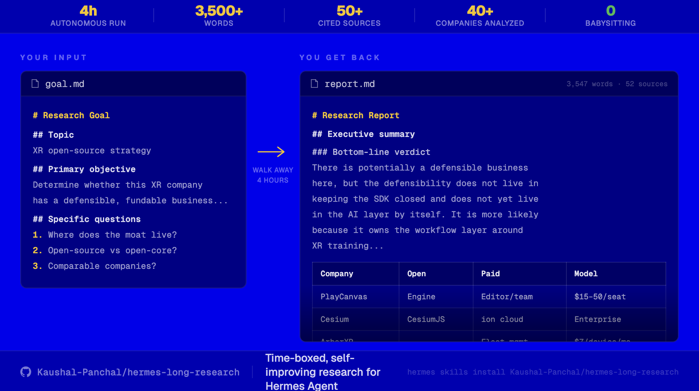

# hermes-long-research

**Time-boxed, self-improving research for [Hermes](https://hermes-agent.nousresearch.com).**
You write a goal, say *"research X for 4 hours,"* walk away. Hermes researches in disciplined
15-minute ticks until the clock runs out, then hands you a cited report with a quality self-grade.

Built because a single chat session can't actually "research for 4 hours" — an LLM has no clock,
so it quits early or rambles past the deadline. This moves the clock **out of the model** and into
Hermes' cron scheduler. Each tick checks the real wall-clock, does one bounded research step, saves
to disk, and exits. Crash-proof, resumable, and the full time window goes to widening coverage.



## Install

```bash
hermes skills tap add Kaushal-Panchal/hermes-long-research
hermes skills install long-research
```

Or install directly from URL:

```bash
hermes skills install https://raw.githubusercontent.com/Kaushal-Panchal/hermes-long-research/main/skills/long-research/SKILL.md --name long-research
```

---

## How it works

A run is many short cron ticks, not one long session. Each tick has **one job**, picked automatically:

```
PLAN      first tick: decompose goal.md into a ranked question checklist (plan.md)
RESEARCH  one open question — broad→narrow search, primary sources, every claim grounded
VERIFY    re-check load-bearing claims against their sources (chain-of-verification)
EXPAND    plan covered but time left? add deeper / adjacent / disconfirming questions
FINALIZE  only at stop_time: polish the report + append a quality self-grade
```

The plan never ends the run — **only the clock does** — so an 8-hour run is 8 hours of coverage.
State lives entirely in files, so any tick can die and the next one continues.

A research folder holds five files:

| File | Who writes it |
|---|---|
| `goal.md` | **You** — the only input |
| `plan.md` | agent — question checklist that drives ticks |
| `report.md` | agent — the living deliverable (ends with a self-grade) |
| `sources.md` | agent — citation log |
| `log.md` | agent — control block (status/stop_time) + tick checkpoints |

---

## Requirements

- **Hermes Agent** installed ([install guide](https://hermes-agent.nousresearch.com/docs)).
- An **LLM provider with web search** — easiest is `hermes setup --portal` (one login = models + web search).
- The **Hermes gateway running** — it's the engine that fires the cron ticks. Not messaging setup;
  just `hermes gateway run`. No gateway = no ticks.

---

## Setup (≈3 minutes)

**Option A — Tap install (recommended):**

```bash
hermes skills tap add Kaushal-Panchal/hermes-long-research
hermes skills install long-research
```

**Option B — Manual clone (if you want to hack on it):**

```bash
# 1. Clone to your home directory (the skill expects ~/LongResearches)
git clone https://github.com/Kaushal-Panchal/hermes-long-research.git ~/LongResearches

# 2. Tell Hermes where the skill is — add to ~/.hermes/config.yaml:
#    skills:
#      external_dirs:
#        - ~/LongResearches/skills
```

**Then start the engine:**

```bash
tmux new -s hermes-gateway 'hermes gateway run'   # Ctrl-b d to detach
hermes gateway status                              # "Gateway is running" = good
```

That's it. (Optional cost tracking → see [Token cost](#token-cost-optional).)

---

## Run a research

1. In a Hermes chat:
   ```
   research <your topic> for 2h
   ```
   The skill scaffolds `~/LongResearches/active/<slug>/` and stops, pointing you at its `goal.md`.
2. Fill in that `goal.md` (see [`examples/goal.example.md`](examples/goal.example.md)) and **delete
   the `⛔ UNFILLED` line**. Then:
   ```
   start
   ```
3. Walk away. Watch progress in `active/<slug>/report.md`, `plan.md`, `log.md`.

**Control mid-run** (edit the control block in `log.md`): abort = `status: done`; extend/shorten =
change `stop_time`; or `hermes cron pause longresearch-<slug>`.

> Sleep / hibernate / reboot kills the gateway (and all ticks). Screen-lock is fine. For multi-hour
> runs, an always-on machine (cheap VPS, Pi, spare laptop) is the reliable host.

---

## Token cost (optional)

Want each report to end with a `## Run cost` block? Enable the bundled hook plugin:

```bash
cp -r ~/LongResearches/plugins/long-research-cost ~/.hermes/plugins/
# then add to ~/.hermes/config.yaml:
#   plugins:
#     enabled:
#       - long-research-cost
```
It appends a per-tick usage line to `log.md`; FINALIZE sums them into the report. No database.

---

## Roadmap

- **Self-improving loop** *(designed, not yet shipped)* — after a run you write a `review.md`; a
  `reflect` pass distills durable, general lessons into a companion `long-research-lessons` skill via
  Hermes' `skill_manage` (its native procedural memory), loaded on every future run and kept tidy by
  Hermes' curator. The core skill is never self-edited.
- **One-command installers** (`install.sh` / `install.ps1`) for Linux / macOS / WSL / Windows.
- **Configurable workspace root** instead of the fixed `~/LongResearches` convention.

---

## Design notes

- **Sequential research only** — no parallel sub-agents (they proved flaky and token-hungry; time
  substitutes for parallelism here).
- **Grounding** — every claim must trace to a logged source.
- **Source quality** — prefers primary/official over SEO content farms.
- Hard-won path-recovery guidance for edge cases lives in `skills/long-research/references/`.

## Contributing

Issues and PRs welcome — especially provider-specific fixes (web-extract fallbacks, the cost
plugin's usage-field extraction) and OS install paths. MIT licensed.

## License

[MIT](LICENSE)
